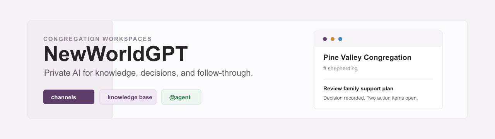
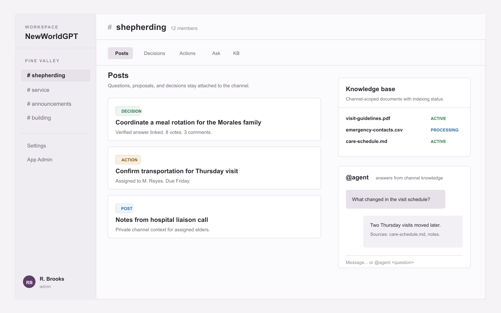

  

# NewWorldGPT

NewWorldGPT, formerly ElderGPT, builds private AI workspaces for congregations that need one trusted place for knowledge, decisions, action items, and document-grounded assistance. It helps elder bodies keep congregation work organized without handing sensitive context to tools they cannot govern.

## What We Are Building

NewWorldGPT combines a congregation workspace, channel discussions, a private knowledge base, and an AI assistant that answers inside the context of each channel.

## What NewWorldGPT Helps With

- Keep congregation channels organized for standing topics, committees, and needs.
- Capture posts, proposals, verified answers, and decisions with context.
- Turn follow-up responsibilities into assigned action items.
- Upload documents to a channel knowledge base and track indexing status, scope, trust weight, and expiry.
- Ask `@agent` questions against the relevant channel knowledge while preserving the source trail.
- Manage invitations, roles, permissions, billing, and admin workflows from one workspace.

## Core Repositories

| Repository | Purpose |
| --- | --- |
| `newworldgpt-ui` | React workspace for congregation channels, posts, action items, knowledge base management, and assistant chat. |
| `newworldgpt-api` | GraphQL API, role-based permissions, notifications, billing hooks, and document workflow coordination. |
| `newworldgpt-functions` | Assistant, ingestion, search, and integration functions that connect knowledge sources to the workspace. |
| `newworldgpt-infra` | Deployment, local development, Terraform, Docker, and service configuration for self-owned infrastructure. |

Repository names may change as the rename finishes. The goal is to keep each package small enough to audit, deploy, and operate independently.

## Product Principles

- **Private by default:** Congregation records, uploaded documents, and assistant context should stay inside infrastructure the organization controls.
- **Role-aware collaboration:** Permissions should reflect how congregations actually delegate work across admins, channel managers, contributors, and readers.
- **Traceable answers:** AI responses should be grounded in the selected channel knowledge and preserve enough source context to review.
- **Stewardship over noise:** The interface should stay calm, dense, and practical so repeated weekly use feels organized instead of distracting.

## For Congregations

Start with one workspace, a small set of channels, and the documents your group already relies on. Use posts for discussion, decisions for agreed outcomes, action items for follow-up, and `@agent` for questions that should be answered from the channel knowledge base.

## For Contributors

Good first contributions usually improve trust and usability: accessibility fixes, clearer empty states, stronger mutation error handling, safer permission checks, test coverage, documentation, and deployment hardening.

Before opening a pull request, read the relevant repository README, run the local test suite, and keep changes scoped to the workflow you are improving.

## Technology

NewWorldGPT currently uses React, TypeScript, Vite, Tailwind CSS, Apollo GraphQL, Supabase, PostgreSQL, Neo4j, Cognee, Open WebUI, Docker, Heroku, and Terraform.

## Contact

For product or congregation setup questions, use the support channel provided by the maintainers. For code issues, open an issue or discussion in the relevant repository.
